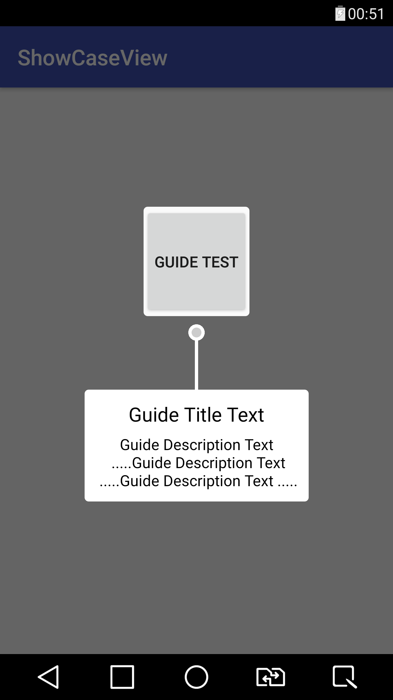
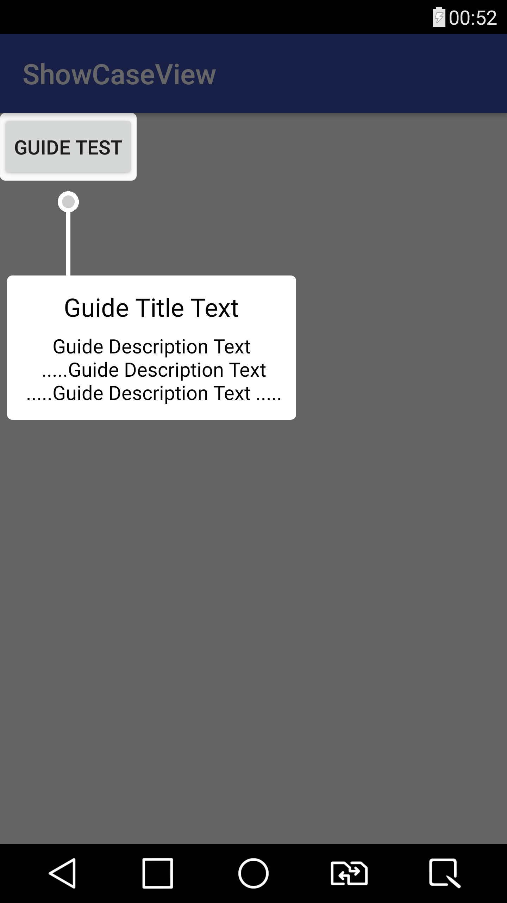
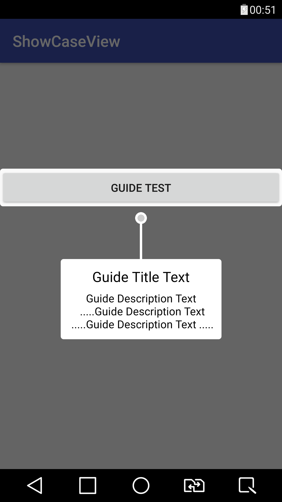

# ShowCaseView

Sample usage in your activity:

    GuideView guideView = new GuideView(this, view);
    guideView.setTitle("Guide Title Text");
    guideView.setContentText("Guide Description Text\n .....Guide Description Text\n .....Guide Description Text .....");
    guideView.setGravity(GuideView.Gravity.CENTER); //optional - default is AUTO
    guideView.show();

