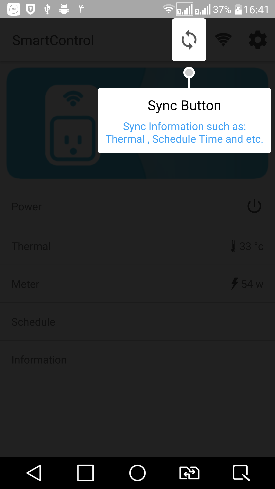
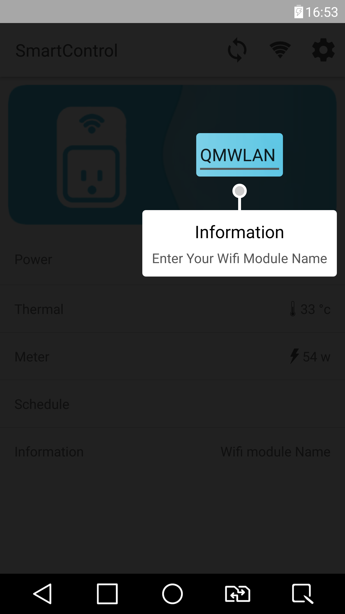
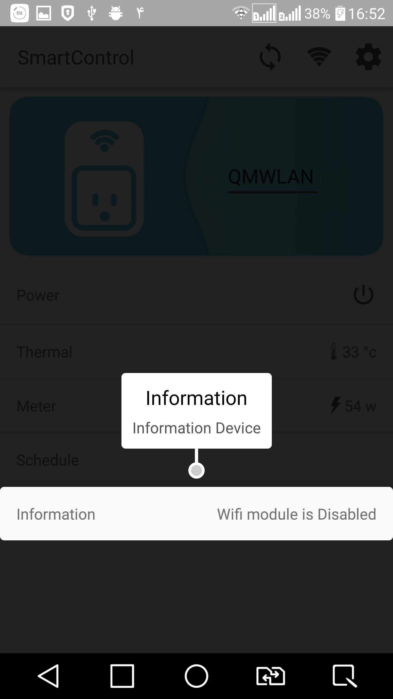
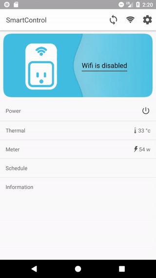

# :flashlight:ShowCaseView:flashlight:
[](https://jitpack.io/#mreram/ShowCaseView)
[](https://github.com/mreram/ShowCaseView/raw/master/demo-flatShowCaseView.apk)
[](https://android-arsenal.com/api?level=11) [](https://android-arsenal.com/details/1/6713)
[](https://github.com/JStumpp/awesome-android#gui)

<p align="center">




</p>

## How to use:question:

Sample usage in your activity
```java
new GuideView.Builder(this)
    .setTitle("Guide Title Text")
    .setContentText("Guide Description Text\n .....Guide Description Text\n .....Guide Description Text .....")
    .setGravity(Gravity.auto) //optional
    .setDismissType(DismissType.anywhere) //optional - default DismissType.targetView
    .setTargetView(view)
    .setContentTextSize(12)//optional
    .setTitleTextSize(14)//optional
    .build()
    .show();
```


## Installation
	
maven:

```xml
<repositories>
   <repository>
     <id>jitpack.io</id>
     <url>https://jitpack.io</url>
   </repository>
</repositories>
```
	Step 2. Add the dependency
```xml
<dependency>
    <groupId>com.github.mreram</groupId>
    <artifactId>showcaseview</artifactId>
    <version>1.4.1</version>
</dependency>
```
gradle:
	
Add it in your root build.gradle at the end of repositories:
```groovy	
allprojects {
	repositories {
		...
		maven { url 'https://jitpack.io' }
	}
}
```	
	Step 2. Add the dependency
```groovy	
implementation 'com.github.mreram:showcaseview:1.4.1'
```
## Change type face
```java
new GuideView.Builder(this)
    .setTitle("Guide Title Text")
    .setContentText("Guide Description Text\n .....Guide Description Text\n .....Guide Description Text .....")
    .setTargetView(view)
    .setContentTypeFace(Typeface)//optional
    .setTitleTypeFace(Typeface)//optional
    .setDismissType(DismissType.outSide) //optional - default dismissible by TargetView
    .build()
    .show();
```

## Change title and Content text size

```java
new GuideView.Builder(this)
    .setTitle("Guide Title Text")
    .setContentText("Guide Description Text\n .....Guide Description Text\n .....Guide Description Text .....")
    .setTargetView(view)
    .setContentTextSize(12)//optional
    .setTitleTextSize(14)//optional
    .setDismissType(DismissType.outSide) //optional - default dismissible by TargetView
    .build()
    .show();
```	
## Change Gravity

```java
new GuideView.Builder(this)
    .setTitle("Guide Title Text")
    .setContentText("Guide Description Text\n .....Guide Description Text\n .....Guide Description Text .....")
    .setGravity(Gravity.CENTER)//optional
    .setTargetView(view) 
    .setDismissType(DismissType.outSide) //optional - default dismissible by TargetView
    .build()
    .show();
```     
	     
## use Spannable for Content
```java	
new GuideView.Builder(this)
    .setTitle("Guide Title Text")
    .setTargetView(view)
    .setContentSpan((Spannable) Html.fromHtml("<font color='red'>testing spannable</p>"))
    .setDismissType(DismissType.outSide) //optional - default dismissible by TargetView
    .build()
    .show();
```

## Set Listener 
```java	
new GuideView.Builder(MainActivity.this)
    .setTitle("Guide Title Text")
    .setContentText("Guide Description Text\n .....Guide Description Text\n .....Guide Description Text .....")
    .setGravity(Gravity.CENTER)
    .setTargetView(view1)
    .setDismissType(DismissType.outSide) //optional - default dismissible by TargetView
    .setGuideListener(new GuideListener() {
        @Override
        public void onDismiss(View view) {
           //TODO ...
        }
     })
    .build()
    .show();
```

### DismissType Attribute

| Type | Description |
| ------ | ------ |
| outside | Dismissing with click on outside of MessageView |
| anywhere | Dismissing with click on anywhere |
| targetView | Dismissing with click on targetView(targetView is assigned with setTargetView method) |
| outsideTargetAndMessage | Dismissing with click on outside of MessageView and target View |


### PointerType Attribute

| Type | Description |
| ------ | ------ |
| circle | Show circle pointer towards targetView |
| arrow | Show arrow pointer towards targetView |
| none | Show no pointer or line towards targetView |


## Contribution :collision:

Pull requests are welcome! :clap:

You can improve/fix some part of it .

Add Tests:

Assuming that the code in question already has automated (unit) tests, do add tests for the code you submit.
This isn't a hard rule. There are various cases where you may need to add code without test coverage (e.g. when adding a Object), but if it can be tested, it should be tested.


## License
```
   Copyright 2018 Mohammad Reza Eram

   Licensed under the Apache License, Version 2.0 (the "License");
   you may not use this file except in compliance with the License.
   You may obtain a copy of the License at

       http://www.apache.org/licenses/LICENSE-2.0

   Unless required by applicable law or agreed to in writing, software
   distributed under the License is distributed on an "AS IS" BASIS,
   WITHOUT WARRANTIES OR CONDITIONS OF ANY KIND, either express or implied.
   See the License for the specific language governing permissions and
   limitations under the License.
   
   
