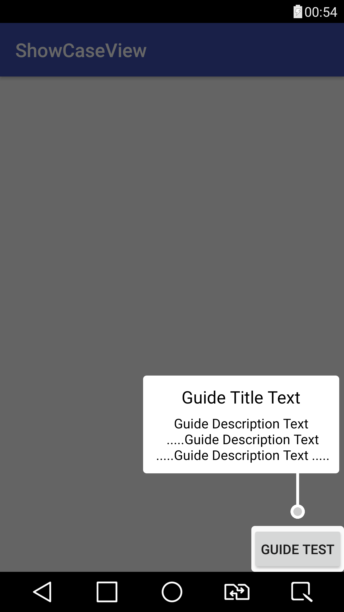

# ShowCaseView

[](https://github.com/mreram/ShowCaseView/raw/master/demo-flatShowCaseView.apk)
[](https://android-arsenal.com/api?level=11) [](https://android-arsenal.com/details/1/6713)

<p align="center">



</p>
Sample usage in your activity:

     new GuideView.Builder(this)
             .setTitle("Guide Title Text")
             .setContentText("Guide Description Text\n .....Guide Description Text\n .....Guide Description Text .....")
             .setGravity(GuideView.Gravity.AUTO)//optional
             .setTargetView(view)
             .setContentTextSize(12)//optional
             .setTitleTextSize(14)//optional
             .build()
             .show();

## Installation
	
maven:

```xml
<repositories>
   <repository>
     <id>jitpack.io</id>
     <url>https://jitpack.io</url>
   </repository>
</repositories>
```
	Step 2. Add the dependency
```xml
<dependency>
   <groupId>com.github.mreram</groupId>
   <artifactId>ShowCaseView</artifactId>
   <version>1.0.4</version>
</dependency>
```
gradle:
	
Add it in your root build.gradle at the end of repositories:
```groovy	
allprojects {
	repositories {
		...
		maven { url 'https://jitpack.io' }
	}
}
```	
	Step 2. Add the dependency
```groovy	
compile 'com.github.mreram:ShowCaseView:1.0.4'
```
## Change type face

 	 new GuideView.Builder(this)
                .setTitle("Guide Title Text")
                .setContentText("Guide Description Text\n .....Guide Description Text\n .....Guide Description Text .....")
                .setTargetView(view)
                .setContentTypeFace(Typeface)//optional
                .setTitleTypeFace(Typeface)//optional
                .build()
                .show();
  
## Change title and Content text size

   	new GuideView.Builder(this)
                .setTitle("Guide Title Text")
                .setContentText("Guide Description Text\n .....Guide Description Text\n .....Guide Description Text .....")
                .setTargetView(view)
                .setContentTextSize(12)//optional
                .setTitleTextSize(14)//optional
                .build()
                .show();
		
## Change Gravity

	new GuideView.Builder(this)
             .setTitle("Guide Title Text")
             .setContentText("Guide Description Text\n .....Guide Description Text\n .....Guide Description Text .....")
             .setGravity(GuideView.Gravity.CENTER)//optional
             .setTargetView(view) 
             .build()
             .show();
	     
	     
## use Spannable for Content
	
	 new GuideView.Builder(this)
                .setTitle("Guide Title Text")
                .setTargetView(view)
                .setContentSpan((Spannable) Html.fromHtml("<font color='red'>testing spannable</p>"))
                .build()
                .show();
                	     
## Set Listener 
	
      new GuideView.Builder(MainActivity.this)
                      .setTitle("Guide Title Text")
                      .setContentText("Guide Description Text\n .....Guide Description Text\n .....Guide Description Text .....")
                      .setGravity(GuideView.Gravity.CENTER)
                      .setTargetView(view1)
                      .setGuideListener(new GuideView.GuideListener() {
                          @Override
                          public void onDismiss(View view) {
                             //TODO ...
                          }
                       })
                       .build()
                       .show();

